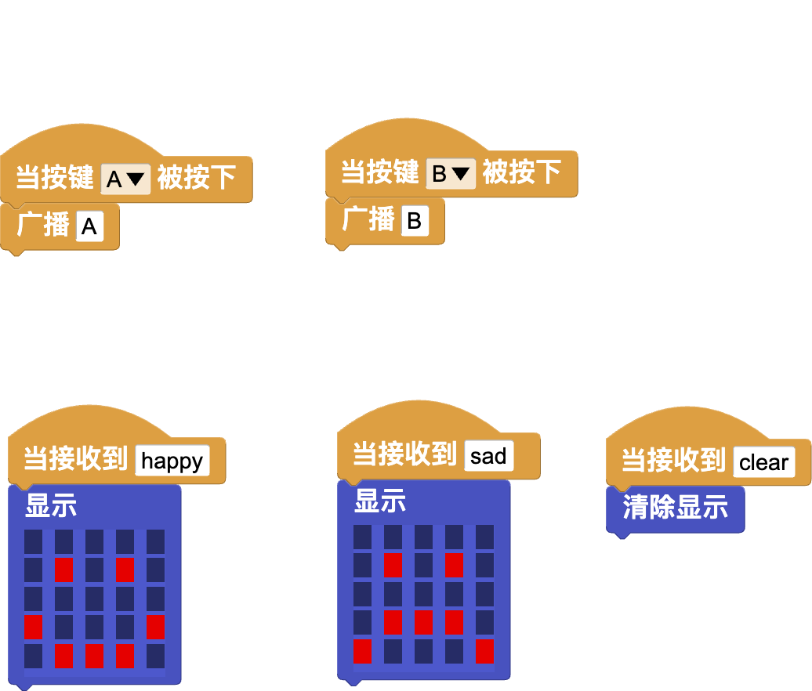
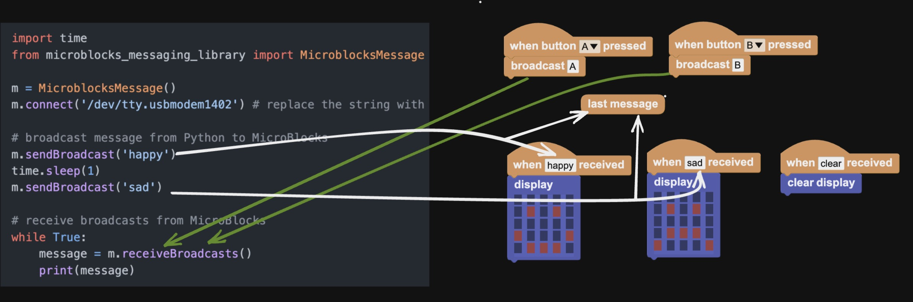

# readme

MicroBlocks and Python Communication with Messages.

# Install

```bash
# Python3
python -m pip install microblocks
```

# Usage

[MicroBlocks demo](https://microblocksfun.cn/run/microblocks.html#project=projectName%20%27%27%0A%0Amodule%20main%0Aauthor%20unknown%0Aversion%201%200%20%0Adescription%20%27%27%0A%0Ascript%20335%2093%20%7B%0AwhenBroadcastReceived%20%27sad%27%0A%27%5Bdisplay%3AmbDisplay%5D%27%2018284864%0A%7D%0A%0Ascript%2091%20116%20%7B%0AwhenBroadcastReceived%20%27happy%27%0A%27%5Bdisplay%3AmbDisplay%5D%27%2015237440%0A%7D%0A%0Ascript%20124%20309%20%7B%0AwhenStarted%0Aforever%20%7B%0A%20%20waitMillis%203000%0A%20%20sendBroadcast%20%27hello%20world%27%0A%7D%0A%7D%0A%0A%0Amodule%20%27LED%20Display%27%20Output%0Aauthor%20MicroBlocks%0Aversion%201%205%20%0Atags%20pixel%20matrix%20led%20tft%20%0Adescription%20%27Display%20primitives%20for%20the%205x5%20LED%20display%20on%20the%20BBC%20micro%3Abit%2C%20Calliope%20mini%20and%20M5Atom%20Matrix.%20Boards%20with%20TFT%20displays%20%28such%20as%20the%20Citilab%20ED1%20or%20the%20M5Stack%20family%29%20support%20these%20primitives%20with%20a%20simulated%20%22fat%20pixel%22%20display.%27%0Avariables%20_stop_scrolling_text%20%0A%0A%20%20spec%20%27%20%27%20%27%5Bdisplay%3AmbDisplay%5D%27%20%27display%20_%27%20%27microbitDisplay%27%2015237440%0A%20%20spec%20%27%20%27%20%27_set%20display%20color%27%20%27set%20display%20color%20_%27%20%27color%27%0A%20%20spec%20%27%20%27%20%27%5Bdisplay%3AmbDisplayOff%5D%27%20%27clear%20display%27%0A%20%20space%0A%20%20spec%20%27%20%27%20%27%5Bdisplay%3AmbPlot%5D%27%20%27plot%20x%20_%20y%20_%27%20%27num%20num%27%203%203%0A%20%20spec%20%27%20%27%20%27%5Bdisplay%3AmbUnplot%5D%27%20%27unplot%20x%20_%20y%20_%27%20%27num%20num%27%203%203%0A%20%20space%0A%20%20spec%20%27%20%27%20%27displayCharacter%27%20%27display%20character%20_%27%20%27str%27%20%27A%27%0A%20%20spec%20%27%20%27%20%27scroll_text%27%20%27scroll%20text%20_%20%3A%20pausing%20_%20ms%27%20%27str%20num%27%20%27HELLO%20ROSA%21%27%20100%0A%20%20spec%20%27%20%27%20%27stopScrollingText%27%20%27stop%20scrolling%27%0A%0Ato%20%27_set%20display%20color%27%20color%20%7B%0A%20%20callCustomCommand%20%27%5Bdisplay%3AmbSetColor%5D%27%20%28%27%5Bdata%3AmakeList%5D%27%20color%29%0A%7D%0A%0Ato%20displayCharacter%20s%20%7B%0A%20%20s%20%3D%20%28%27%5Bdata%3Ajoin%5D%27%20%27%27%20s%29%0A%20%20if%20%28%28size%20s%29%20%3D%3D%200%29%20%7B%0A%20%20%20%20%27%5Bdisplay%3AmbDisplayOff%5D%27%0A%20%20%20%20return%200%0A%20%20%7D%0A%20%20%27%5Bdisplay%3AmbDrawShape%5D%27%20%28%27%5Bdisplay%3AmbShapeForLetter%5D%27%20%28at%201%20s%29%29%0A%7D%0A%0Ato%20scroll_text%20text%20optionalDelay%20%7B%0A%20%20text%20%3D%20%28%27%5Bdata%3Ajoin%5D%27%20%27%27%20text%29%0A%20%20local%20%27delay%27%20100%0A%20%20if%20%28%28pushArgCount%29%20%3E%201%29%20%7B%0A%20%20%20%20delay%20%3D%20optionalDelay%0A%20%20%7D%0A%20%20_stop_scrolling_text%20%3D%20%28booleanConstant%20false%29%0A%20%20if%20%28%27Pico%3Aed%27%20%3D%3D%20%28boardType%29%29%20%7B%0A%20%20%20%20for%20position%20%28%28%28size%20text%29%20%2A%206%29%20%2B%2018%29%20%7B%0A%20%20%20%20%20%20if%20_stop_scrolling_text%20%7Breturn%200%7D%0A%20%20%20%20%20%20%27%5Bdisplay%3AmbDisplayOff%5D%27%0A%20%20%20%20%20%20%27%5Btft%3Atext%5D%27%20text%20%2817%20-%20position%29%200%20%28colorSwatch%20125%20125%20125%20255%29%201%20true%0A%20%20%20%20%20%20waitMillis%20%28delay%20%2F%202%29%0A%20%20%20%20%7D%0A%20%20%7D%20else%20%7B%0A%20%20%20%20for%20position%20%28%28%28size%20text%29%20%2A%206%29%20%2B%206%29%20%7B%0A%20%20%20%20%20%20if%20_stop_scrolling_text%20%7Breturn%200%7D%0A%20%20%20%20%20%20for%20i%20%28size%20text%29%20%7B%0A%20%20%20%20%20%20%20%20%27%5Bdisplay%3AmbDrawShape%5D%27%20%28%27%5Bdisplay%3AmbShapeForLetter%5D%27%20%28%27%5Bdata%3AunicodeAt%5D%27%20i%20text%29%29%20%28%28%28i%20%2A%206%29%20%2B%202%29%20-%20position%29%201%0A%20%20%20%20%20%20%7D%0A%20%20%20%20%20%20waitMillis%20delay%0A%20%20%20%20%7D%0A%20%20%7D%0A%7D%0A%0Ato%20stopScrollingText%20%7B%0A%20%20_stop_scrolling_text%20%3D%20%28booleanConstant%20true%29%0A%20%20waitMillis%2010%0A%20%20%27%5Bdisplay%3AmbDisplayOff%5D%27%0A%7D%0A%0A)

## wireless programming (BLE)

```python
import time
from microblocks import Message

m = Message()
# found_devices = m.discover() # Discover MicroBlocks devices
m.connect('MicroBlocks KCY') # replace the string with the device name

# broadcast message from Python to MicroBlocks
m.send('happy')
time.sleep(1)
m.send('sad')

# receive broadcasts from MicroBlocks
while True:
    message = m.receive()
    if message:
        print(message)

# receive(non-blocking) broadcasts from MicroBlocks. Work with m.on_message = <a function>
# m.loopStart()
```

## serial

```python
import time
from microblocks import SerialMessage

m = SerialMessage()
m.connect('/dev/tty.usbmodem1402') # replace the string with micro:bit port

# broadcast message from Python to MicroBlocks
m.send('happy')
time.sleep(1)
m.send('sad')

# receive broadcasts from MicroBlocks
while True:
    message = m.receive()
    if message:
        print(message)

# receive(non-blocking) broadcasts from MicroBlocks. Work with m.on_message = <a function>
# m.loopStart()
```

Work with the MicroBlocks code (you can save this PNG file, then drag it into MicroBlocks to load the scripts):



## message flow diagram


## MicroBlocks interoperability
- [MicroBlocks and Snap! Communication with Messages](https://wiki.microblocks.fun/snap/microblocks_snap_messaging)
- [Microblocks Serial Protocol (version 2.09)](https://bitbucket.org/john_maloney/smallvm/src/master/misc/SERIAL_PROTOCOL.md)