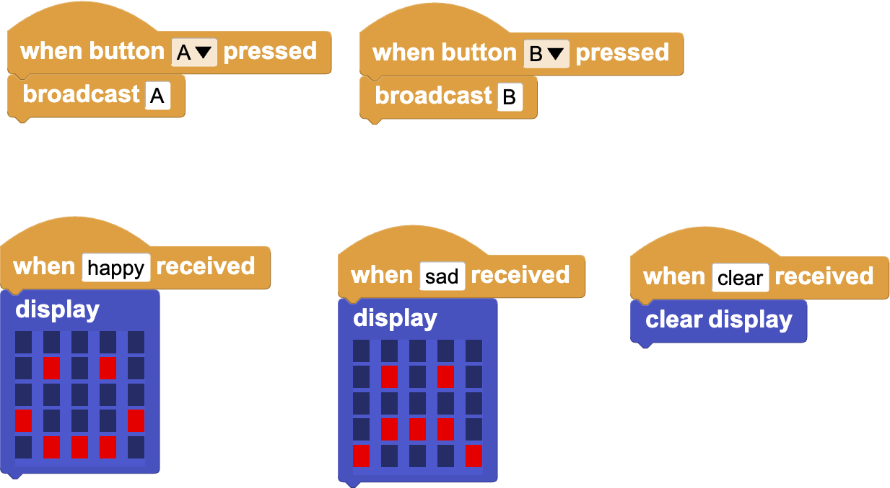

# readme

MicroBlocks and Python Communication with Messages.

# Install

```bash
# Python3
python -m pip install microblocks_messaging_library
```

# Usage

## wireless programming (BLE)

```python
import time
from microblocks_messaging_library import MicroblocksBLEMessage

m = MicroblocksBLEMessage()
# m.discover() # Discover MicroBlocks devices
m.connect('MicroBlocks KCY') # replace the string with the device name

# broadcast message from Python to MicroBlocks
m.sendBroadcast('happy')
time.sleep(1)
m.sendBroadcast('sad')

# receive broadcasts from MicroBlocks
while True:
    message = m.receiveBroadcasts()
    if message:
        print(message)
```

## serial

```python
import time
from microblocks_messaging_library import MicroblocksMessage

m = MicroblocksMessage()
m.connect('/dev/tty.usbmodem1402') # replace the string with micro:bit port

# broadcast message from Python to MicroBlocks
m.sendBroadcast('happy')
time.sleep(1)
m.sendBroadcast('sad')

# receive broadcasts from MicroBlocks
while True:
    message = m.receiveBroadcasts()
    if message:
        print(message)
```

Work with the MicroBlocks code (you can save this PNG file, then drag it into MicroBlocks to load the scripts):



## message flow diagram


## MicroBlocks interoperability
- [MicroBlocks and Snap! Communication with Messages](https://wiki.microblocks.fun/snap/microblocks_snap_messaging)
- [Microblocks Serial Protocol (version 2.09)](https://bitbucket.org/john_maloney/smallvm/src/master/misc/SERIAL_PROTOCOL.md)